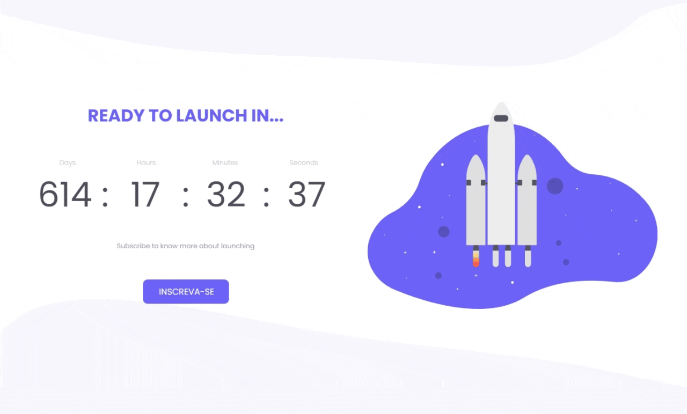
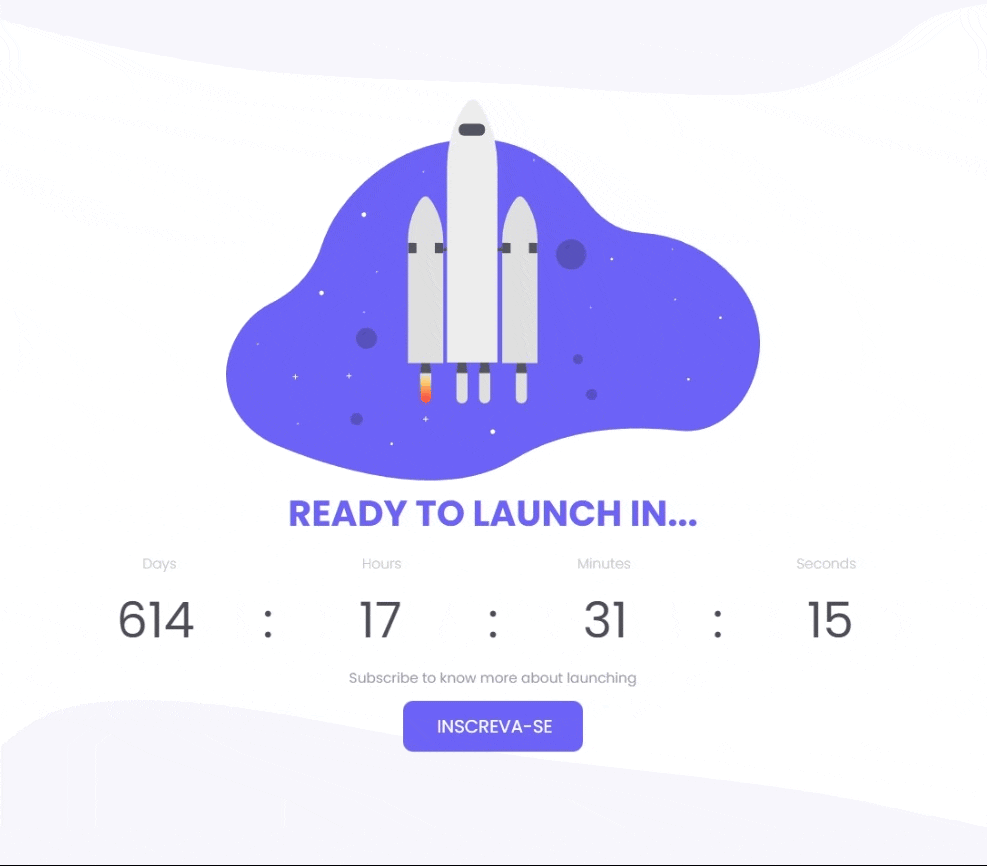

# frontend-loginform
<h2>Challenge frontend Countdown</h2>

<h2>Responsive Page</h2>

<strong>:hammer_and_wrench: Project:</strong> Convert figma Layout to Frontend code. Using:

<ul>
  <li> HTML</li>
  <li> CSS</li>
  <li> Sass SCSS</li>
  <li> Media Queries</li>
  <li> Flexbox</li>
  <li> Javascript</li>
</ul>

I wrote from scratch all code without any video reference.

In CSS, along with Sass, I'm using colors variables, viewport breakpoints, REM sizes, CSS reset, media queries and flexbox.

<h3>Plus:</h3>

I added Sass to the project to help me on some CSS settings.

I made a Javascript countdown timer relative to an specified launch date, followed by a subscribe button next to it, as asked in Figma project.

It wasn't requested, but I added a responsible mobile size as a bonus.

<h2>Example Images</h2>

Desktop 

Tablet 

Mobile 

